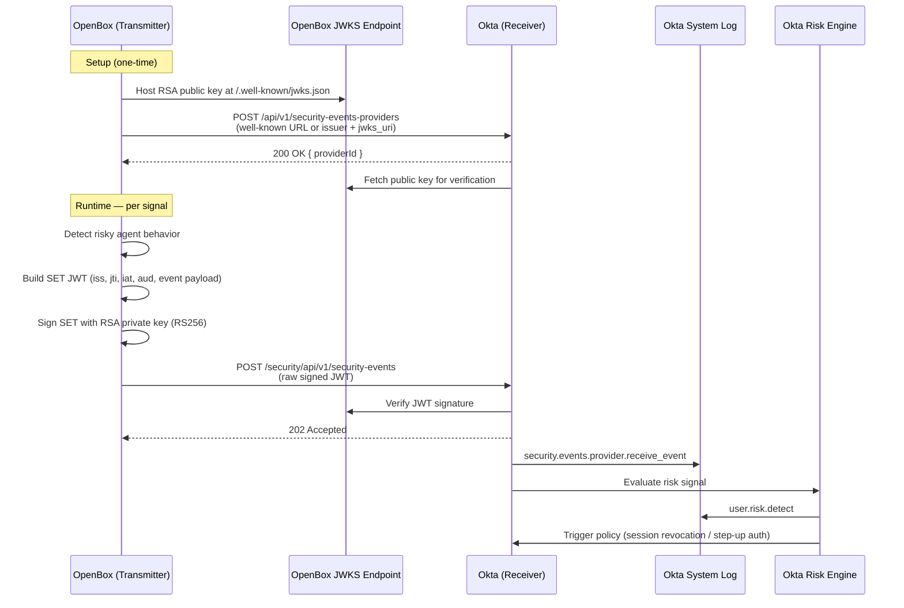

# OpenBox → Okta: Shared Signals Framework Integration

> Build an SSF Transmitter that sends risk signals from OpenBox directly into Okta's risk engine. Okta is ready to receive — you just need to build the transmitter.

## Table of Contents

- [Overview](#overview)
- [Quick Start](#quick-start)
- [Prerequisites](#prerequisites)
- [Step 1: Keys \& Endpoints](#step-1-keys--endpoints)
- [Step 2: Register with Okta](#step-2-register-with-okta)
- [Step 3: Event Reference](#step-3-event-reference)
- [Step 4: Sending SETs](#step-4-sending-sets)
- [Step 5: Verifying in Okta](#step-5-verifying-in-okta)
- [Production Hardening](#production-hardening)
- [References](#references)

---

## Overview

When OpenBox detects risky AI agent behavior, it can push that signal directly into Okta's risk engine via the [Shared Signals Framework (SSF)](https://sharedsignals.guide). Okta evaluates the signal and triggers adaptive policies — session revocation, step-up auth, or Universal Logout — automatically.

**OpenBox is the transmitter. Okta is the receiver. No changes are needed on Okta's end.**

Signals are [Security Event Tokens (SETs)](https://datatracker.ietf.org/doc/html/rfc8417) — JWTs signed with your RSA private key and delivered over HTTPS. Okta supports three event types from OpenBox: [user risk change](#user-risk-change), [session revoked](#caep-session-revoked), and [credential change](#caep-credential-change).
