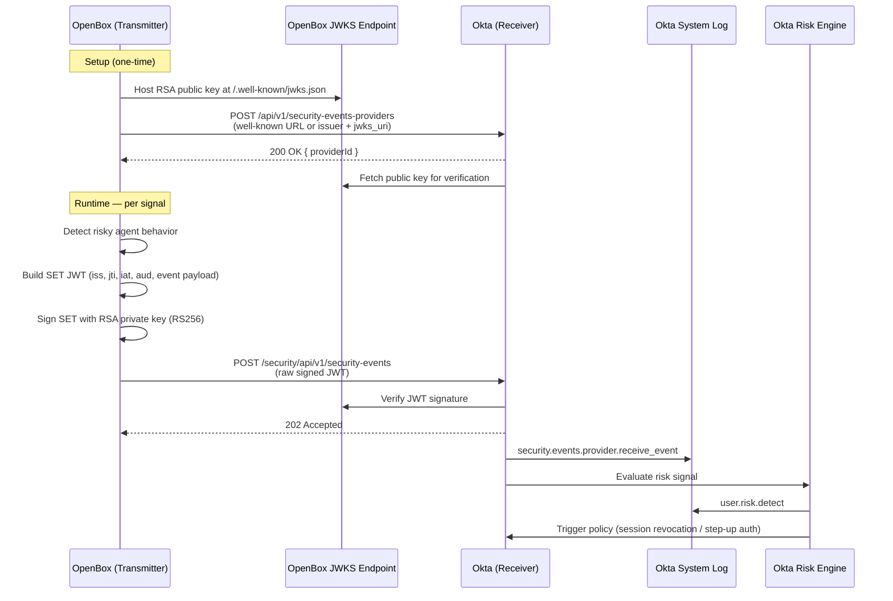

# OpenBox → Okta: Shared Signals Framework Integration

> Build an SSF Transmitter that sends risk signals from OpenBox directly into Okta's risk engine. Okta is ready to receive — you just need to build the transmitter.

## Table of Contents

- [Overview](#overview)
- [Quick Start](#quick-start)
- [Prerequisites](#prerequisites)
- [Step 1: Keys \& Endpoints](#step-1-keys--endpoints)
- [Step 2: Register with Okta](#step-2-register-with-okta)
- [Step 3: Event Reference](#step-3-event-reference)
- [Step 4: Sending SETs](#step-4-sending-sets)
- [Step 5: Verifying in Okta](#step-5-verifying-in-okta)
- [Production Hardening](#production-hardening)
- [References](#references)

---

## Overview

When OpenBox detects risky AI agent behavior, it can push that signal directly into Okta's risk engine via the [Shared Signals Framework (SSF)](https://sharedsignals.guide). Okta evaluates the signal and triggers adaptive policies — session revocation, step-up auth, or Universal Logout — automatically.

**OpenBox is the transmitter. Okta is the receiver. No changes are needed on Okta's end.**



Signals are [Security Event Tokens (SETs)](https://datatracker.ietf.org/doc/html/rfc8417) — JWTs signed with your RSA private key and delivered over HTTPS. Okta supports three event types from OpenBox: [user risk change](#user-risk-change), [session revoked](#caep-session-revoked), and [credential change](#caep-credential-change).

---

## Prerequisites

- **Okta org with Identity Threat Protection (ITP) enabled** — SSF receiver functionality requires ITP. Confirm under Security > Identity Threat Protection in the Okta Admin Console.
- **Okta API token** with permission to manage security events providers. Generate one under Security > API > Tokens.
- **Publicly accessible HTTPS host** for your JWKS endpoint (e.g., `https://your.openbox.instance/.well-known/jwks.json`). Okta fetches this during registration and to verify every incoming SET.
- *(Optional but recommended)* **HTTPS host for `.well-known/ssf-configuration`** — enables SSF-compliant auto-discovery. Required for the SSF-compliant registration variant in Step 2.

---

## Quick Start

Get a working transmitter in ~10 minutes.

### 1. Generate a keypair and build your JWKS

Install dependencies:

```bash
pip install cryptography PyJWT requests
```

Run this script to generate an RSA-2048 keypair and print your JWKS:

```python
# generate_keys.py
from cryptography.hazmat.primitives.asymmetric import rsa
from cryptography.hazmat.primitives import serialization
from cryptography.hazmat.backends import default_backend
import base64, hashlib, json

private_key = rsa.generate_private_key(
    public_exponent=65537,
    key_size=2048,
    backend=default_backend()
)

with open("private_key.pem", "wb") as f:
    f.write(private_key.private_bytes(
        encoding=serialization.Encoding.PEM,
        format=serialization.PrivateFormat.PKCS8,
        encryption_algorithm=serialization.NoEncryption()
    ))

pub = private_key.public_key().public_numbers()

def to_b64url(n: int) -> str:
    return base64.urlsafe_b64encode(
        n.to_bytes((n.bit_length() + 7) // 8, "big")
    ).rstrip(b"=").decode()

n_b64 = to_b64url(pub.n)
kid = hashlib.sha256(n_b64.encode()).hexdigest()[:16]

jwks = {"keys": [{"kty": "RSA", "use": "sig", "alg": "RS256",
                  "kid": kid, "n": n_b64, "e": to_b64url(pub.e)}]}
print(json.dumps(jwks, indent=2))
# Copy the kid value — you'll need it when building SETs
print(f"\nkid: {kid}")
```

Host the printed JWKS JSON at `https://your.openbox.instance/.well-known/jwks.json` with `Content-Type: application/json`.

### 2. Register with Okta

```bash
curl -X POST https://your-org.okta.com/api/v1/security-events-providers \
  -H "Authorization: SSWS <your-api-token>" \
  -H "Content-Type: application/json" \
  -d '{
    "name": "OpenBox",
    "type": "SecurityEventsProvider",
    "settings": {
      "wellKnownUrl": "https://your.openbox.instance/.well-known/ssf-configuration"
    }
  }'
```

Save the `id` field from the response — that's your `providerId`.

### 3. Build and sign a SET

```python
# send_risk_change.py
import jwt, uuid, time

with open("private_key.pem", "rb") as f:
    private_key_pem = f.read()

KID = "<kid from generate_keys.py>"
ISSUER = "https://your.openbox.instance/"   # must match registered issuer exactly
OKTA_ORG = "https://your-org.okta.com/"    # trailing slash required

now = int(time.time())
payload = {
    "iss": ISSUER,
    "jti": uuid.uuid4().hex,   # must be unique per SET — duplicates are silently dropped
    "iat": now,
    "aud": OKTA_ORG,
    "https://schemas.okta.com/secevent/okta/event-type/user-risk-change": {
        "subject": {"user": {"format": "email", "email": "user@example.com"}},
        "event_timestamp": now,
        "previous_level": "low",
        "current_level": "high",
    }
}

token = jwt.encode(payload, private_key_pem, algorithm="RS256",
                   headers={"kid": KID, "typ": "secevent+jwt"})
```

### 4. Send the SET

```python
import requests

resp = requests.post(
    f"{OKTA_ORG}security/api/v1/security-events",
    data=token,
    headers={
        "Authorization": "SSWS <your-api-token>",
        "Content-Type": "application/secevent+jwt",
    }
)
print(resp.status_code)  # 202 = success
```

### 5. Verify in Okta System Log

In the Okta Admin Console go to **Reports > System Log** and search for:

- `security.events.provider.receive_event` — Okta received the SET
- `user.risk.detect` — risk signal was processed by the risk engine

---

## Step 1: Keys & Endpoints

### Keypair requirements

| Parameter | Value |
|-----------|-------|
| Key type | RSA |
| Key size | 2048 bits |
| Algorithm | RS256 |
| Key use | sig |
| Key ID (`kid`) | SHA-256 of base64url-encoded modulus (first 16 hex chars) |

The [Quick Start script](#1-generate-a-keypair-and-build-your-jwks) generates a compliant keypair. For production, generate keys in your secrets manager — never write the private key to disk unencrypted.

### JWKS endpoint

Host the following JSON at a publicly accessible HTTPS URL (e.g. `https://your.openbox.instance/.well-known/jwks.json`) with `Content-Type: application/json`:

```json
{
  "keys": [
    {
      "kty": "RSA",
      "use": "sig",
      "alg": "RS256",
      "kid": "<your-key-id>",
      "n": "<base64url-encoded-modulus>",
      "e": "AQAB"
    }
  ]
}
```

Okta fetches this URL during provider registration and on every incoming SET to verify the JWT signature. It must be publicly reachable without authentication.

### `.well-known/ssf-configuration` (optional)

For SSF-compliant auto-discovery, host the following at `https://your.openbox.instance/.well-known/ssf-configuration`:

```json
{
  "issuer": "https://your.openbox.instance/",
  "jwks_uri": "https://your.openbox.instance/.well-known/jwks.json"
}
```

If you host this, provide only `wellKnownUrl` during registration. If you skip it, provide `issuer` + `jwksUrl` directly (see [Step 2](#step-2-register-with-okta)).

---

## Step 2: Register with Okta

Register OpenBox as a security events provider so Okta knows your issuer and can verify SETs signed with your key.

### SSF-compliant (recommended)

Use if you host `.well-known/ssf-configuration`:

```bash
curl -X POST https://your-org.okta.com/api/v1/security-events-providers \
  -H "Authorization: SSWS <your-api-token>" \
  -H "Content-Type: application/json" \
  -d '{
    "name": "OpenBox",
    "type": "SecurityEventsProvider",
    "settings": {
      "wellKnownUrl": "https://your.openbox.instance/.well-known/ssf-configuration"
    }
  }'
```

### Non-SSF-compliant

Use if you're hosting JWKS directly without a well-known config:

```bash
curl -X POST https://your-org.okta.com/api/v1/security-events-providers \
  -H "Authorization: SSWS <your-api-token>" \
  -H "Content-Type: application/json" \
  -d '{
    "name": "OpenBox",
    "type": "SecurityEventsProvider",
    "settings": {
      "issuer": "https://your.openbox.instance/",
      "jwksUrl": "https://your.openbox.instance/.well-known/jwks.json"
    }
  }'
```

### Response

```json
{
  "id": "sse0a4tsrkqfyFxBJ0g7",
  "name": "OpenBox",
  "type": "SecurityEventsProvider",
  "status": "ACTIVE",
  "settings": {
    "issuer": "https://your.openbox.instance/",
    "jwksUrl": "https://your.openbox.instance/.well-known/jwks.json"
  }
}
```

Save the `id` as your `providerId`.

### Lifecycle endpoints

| Action | Request |
|--------|---------|
| List all providers | `GET /api/v1/security-events-providers` |
| Retrieve | `GET /api/v1/security-events-providers/{providerId}` |
| Update | `PUT /api/v1/security-events-providers/{providerId}` |
| Deactivate | `POST /api/v1/security-events-providers/{providerId}/lifecycle/deactivate` |
| Delete | `DELETE /api/v1/security-events-providers/{providerId}` |

Full request/response schemas: [Configure an SSF receiver and publish a SET — Okta Developer](https://developer.okta.com/docs/guides/configure-ssf-receiver/main)

---

## Step 3: Event Reference

All SETs share the same JWT header:

```json
{
  "kid": "<your-key-id>",
  "typ": "secevent+jwt",
  "alg": "RS256"
}
```

### user-risk-change

OpenBox's primary signal. Send this when a user's risk level changes due to AI agent behavior.

```json
{
  "iss": "https://your.openbox.instance/",
  "jti": "24c63fb56e5a2d77a6b512616ca9fa24",
  "iat": 1750980770,
  "aud": "https://your-org.okta.com/",
  "https://schemas.okta.com/secevent/okta/event-type/user-risk-change": {
    "subject": {
      "user": { "format": "email", "email": "user@example.com" }
    },
    "event_timestamp": 1750980770,
    "previous_level": "low",
    "current_level": "high"
  }
}
```

**Risk levels:** `low` | `medium` | `high`

### CAEP Session Revoked

Send this when an active session should be terminated immediately.

Use `format: "email"` if OpenBox identifies users by email (simplest). Use `format: "iss_sub"` if you have the Okta user ID (`sub`) available — replace `"iss"` with your Okta org URL and `"sub"` with the Okta user ID.

```json
{
  "iss": "https://your.openbox.instance/",
  "jti": "9d3a8f2b1c4e567890abcdef12345678",
  "iat": 1750980770,
  "aud": "https://your-org.okta.com/",
  "https://schemas.openid.net/secevent/caep/event-type/session-revoked": {
    "subject": {
      "format": "email",
      "email": "user@example.com"
    },
    "reason_admin": { "en": "Risky agent activity detected by OpenBox" },
    "event_timestamp": 1750980770
  }
}
```

### CAEP Credential Change

Send this when a credential has been created, updated, revoked, or deleted.

```json
{
  "iss": "https://your.openbox.instance/",
  "jti": "abc123def456789012345678abcdef01",
  "iat": 1750980770,
  "aud": "https://your-org.okta.com/",
  "https://schemas.openid.net/secevent/caep/event-type/credential-change": {
    "subject": {
      "format": "email",
      "email": "user@example.com"
    },
    "credential_type": "password",
    "change_type": "revoke",
    "event_timestamp": 1750980770
  }
}
```

**Supported `credential_type` + `change_type` combinations:**

| `credential_type` | `change_type` | Triggered by |
|---|---|---|
| `fido2-roaming` | `create` | MFA factor activate |
| `x509` | `delete` | MFA factor deactivate |
| `ALL_FACTORS` | `revoke` | MFA factor reset all |
| `OKTA_VERIFY_PUSH` | `update` | MFA factor suspend/unsuspend |
| `phone-sms` | `update` | MFA factor update |
| `DUO_SECURITY` | `update` | MFA factor update |
| `password` | `revoke` | Password reset |
| `password` | `revoke` | Password update |
