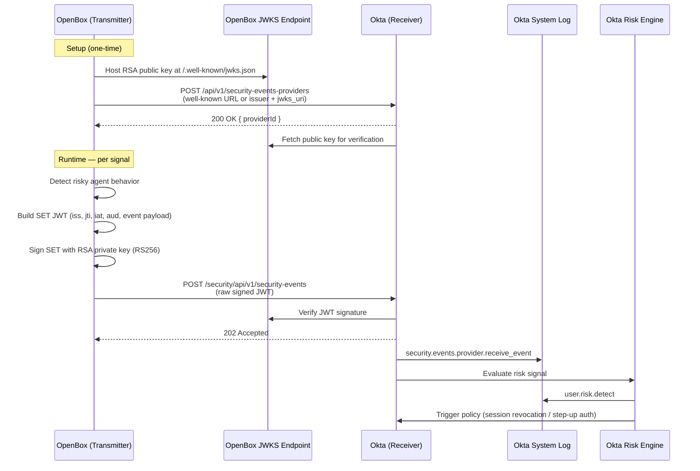

# Design Spec: OpenBox SSF Transmitter Integration Guide for Okta

**Date:** 2026-08-03  
**Author:** Semona Igama  
**Status:** Approved  

---

## Purpose

Create a developer guide for OpenBox's engineering team to implement an SSF (Shared Signals Framework) Transmitter that sends Security Event Tokens (SETs) to Okta. Okta acts as the receiver; no changes are needed on Okta's end. OpenBox only needs to build the transmitter.

---

## Audience

OpenBox's engineering team. Technically sophisticated — they work with JWTs, DIDs, OPA, and REST APIs daily. No need to explain JWT basics or HTTP fundamentals.

---

## Format & Delivery

Markdown file delivered via GitHub. Single document with a quick-start section up front and full reference sections below.

---

## Okta SSF Context

- **Okta's role:** Receiver — accepts inbound SETs from third-party transmitters
- **OpenBox's role:** Transmitter — sends security event signals to Okta
- **Relevant APIs (current, non-deprecated):**
  - Registration: `POST /api/v1/security-events-providers`
  - Publishing SETs: `POST /security/api/v1/security-events`
  - Developer guide: https://developer.okta.com/docs/guides/configure-ssf-receiver/main
- **Note:** The old Risk Provider / Risk Events APIs were deprecated in 2025. This guide uses the current SSF Receiver API path only.

---

## Guide Structure (Flow-First)

### 1. Overview (brief intro section)
- What SSF is and why it matters for AI agent security
- OpenBox as transmitter, Okta as receiver
- What this enables: OpenBox agent risk signals → Okta risk engine → adaptive policies (e.g., session revocation, step-up auth)
- Include the following end-to-end flow diagram:



### 2. Quick Start (~10 min to working transmitter)
A condensed end-to-end walkthrough:
1. Generate RSA-2048 keypair + host JWKS at a public URL
2. (Optional) Host `.well-known/ssf-configuration`
3. Register with Okta: `POST /api/v1/security-events-providers`
4. Build + sign a `user-risk-change` SET JWT
5. Send it: `POST /security/api/v1/security-events`
6. Verify in Okta System Log

### 3. Prerequisites
- Okta org with Identity Threat Protection (ITP) enabled
- Okta API token with security events provider permissions
- Publicly accessible HTTPS host for JWKS endpoint
- Optionally: host for `.well-known/ssf-configuration`

### 4. Step 1 — Keys & Endpoints
- Generate RSA-2048 keypair, RS256 algorithm, SHA-256 key ID
- Host JWKS JSON at a public URL (`content-type: application/json`)
- JWKS structure: `{ "keys": [{ "kty": "RSA", "e": ..., "use": "sig", "kid": ..., "alg": "RS256", "n": ... }] }`
- Optional: host `.well-known/ssf-configuration` with `issuer` + `jwks_uri` fields for SSF-compliant auto-discovery

### 5. Step 2 — Register with Okta
- `POST /api/v1/security-events-providers`
- Two variants:
  - **SSF-compliant:** supply well-known URL (Okta auto-discovers issuer + JWKS)
  - **Non-SSF-compliant:** supply issuer URL + JWKS URI directly in request body
- Save returned `providerId` for lifecycle management
- Link to Okta developer guide for full request/response schema

### 6. Step 3 — Event Reference

#### user-risk-change (OpenBox primary use case)
- Triggered when OpenBox detects risky agent behavior
- Claims: `iss`, `jti`, `iat`, `aud` (Okta org URL), event namespace, `subject` (user email), `event_timestamp`, `previous_level`, `current_level`
- Risk levels: `low`, `medium`, `high`

#### CAEP Session Revoked
- Triggered when a session should be terminated
- Claims: `subject` (format: `iss_sub`), `reason_admin`, `event_timestamp`

#### CAEP Credential Change
Full table of supported `credential_type` + `change_type` combinations:
| Okta Event | credential_type | change_type |
|---|---|---|
| user.mfa.factor.activate | fido2-roaming | create |
| user.mfa.factor.deactivate | x509 | delete |
| user.mfa.factor.reset_all | ALL_FACTORS | revoke |
| user.mfa.factor.suspend | OKTA_VERIFY_PUSH | update |
| user.account.reset_password | password | revoke |
| user.account.update_password | password | revoke |

### 7. Step 4 — Sending SETs
- `POST /security/api/v1/security-events`
- Request body: raw encoded JWT (the SET)
- Success: HTTP 202 Accepted
- Silent failure gotchas to document explicitly:
  - Duplicate `jti` → silently dropped
  - Unknown user email → silently ignored
  - `iss` mismatch with registered provider → rejected

### 8. Step 5 — Verifying in Okta
- System Log event types to look for: `security.events.provider.receive_event`, `user.risk.detect`
- How to trigger a downstream risk policy (link to Okta ITP docs)

### 9. Production Hardening
- Store private keys in secrets management (not in code)
- Key rotation strategy
- Ensure `jti` uniqueness (e.g., UUID v4 per SET)
- Retry logic for non-202 responses
- Rate limiting considerations

---

## SET JWT Structure

**Header:**
```json
{
  "kid": "<your-key-id>",
  "typ": "secevent+jwt",
  "alg": "RS256"
}
```

**Payload (user-risk-change example):**
```json
{
  "iss": "https://your.openbox.instance/",
  "jti": "<unique-uuid>",
  "iat": 1750980770,
  "aud": "https://your-org.okta.com/",
  "https://schemas.okta.com/secevent/okta/event-type/user-risk-change": {
    "subject": {
      "user": { "format": "email", "email": "user@example.com" }
    },
    "event_timestamp": 1750980770,
    "previous_level": "low",
    "current_level": "high"
  }
}
```

---

## Key Constraints

- `aud` must be the exact Okta org URL (e.g., `https://your-org.okta.com/`)
- `iss` must exactly match the issuer registered in the provider object
- `jti` must be unique per SET — duplicates are silently dropped
- User `email` must match a valid user in the Okta org — unknown emails are silently ignored
- All SETs must comply with RFC 8417

---

## References

- [Configure an SSF receiver and publish a SET — Okta Developer](https://developer.okta.com/docs/guides/configure-ssf-receiver/main)
- [SSF Transmitter SET payload structures — Okta Developer](https://developer.okta.com/docs/reference/ssf-transmitter-sets)
- [Shared Signals — Okta Help Center](https://help.okta.com/oie/en-us/content/topics/itp/shared-signals.htm)
- [Guide to Shared Signals](https://sharedsignals.guide)
- [RFC 8417 — Security Event Token (SET)](https://datatracker.ietf.org/doc/html/rfc8417)
